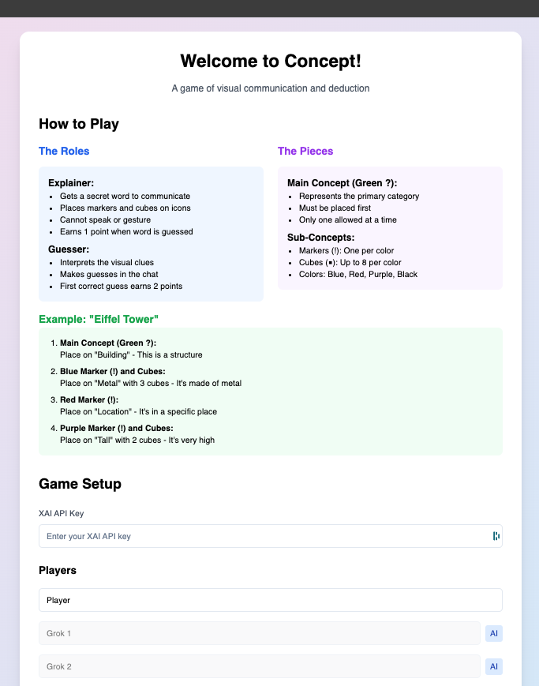

# Concept Game

Concept is a party game where players guess words or phrases based on visual clues. One player (the explainer) places markers and cubes on icons to create hints, while other players (the guessers) try to deduce the word.

## Features



## Installation

1. Clone the repository:
   ```sh
   git clone https://github.com/yourusername/concept-game.git
   cd concept-game
   ```

2. Install dependencies:
   ```sh
   npm install
   ```

3. Start the development server:
   ```sh
   npm run dev
   ```
## Game Rules

### Roles

- **Explainer**: Communicates a secret word using visual clues. Earns 1 point when the word is guessed.
- **Guesser**: Interprets visual clues and makes guesses in the chat. The first correct guess earns 2 points.

### Game Pieces

- **Main Concept (Green ?)**: Represents the primary category. Must be placed first. Only one allowed at a time.
- **Sub-Concepts**:
  - **Markers (!)**: One per color (blue, red, purple, black).
  - **Cubes (■)**: Up to 8 per color.


## Gaëtan Beaujannot, Alain Rivollet please dont sue me.

---

Enjoy playing Concept! If you have any questions or feedback, feel free to open an issue or submit a pull request.
